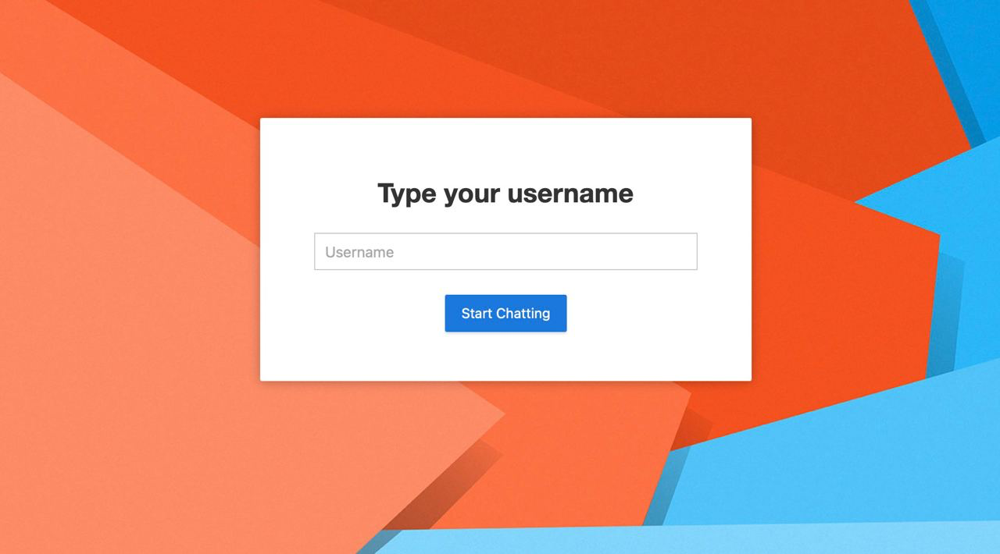
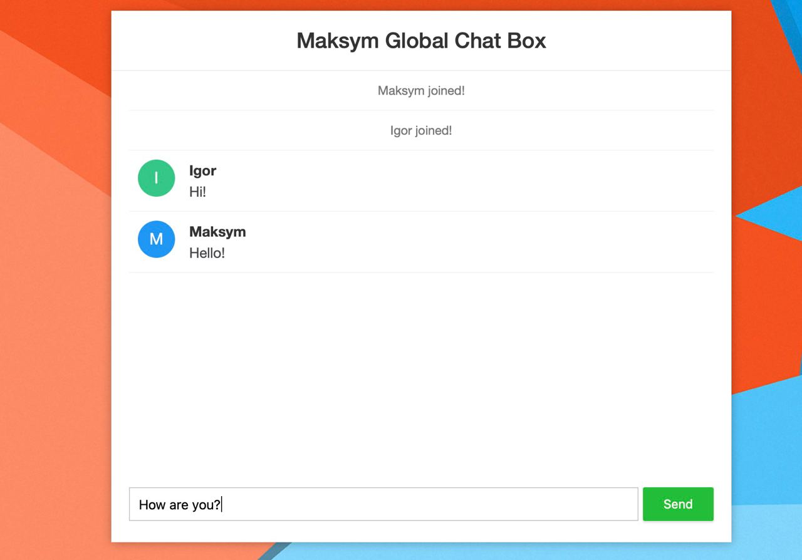

# Simple Spring WebSocket Chat Application

This is a basic chat application built using Spring Boot and WebSocket, allowing users to engage in real-time text-based conversations. The application provides a simple interface for multiple users to join the chat room and communicate with each other.



## Features

- Real-time communication using WebSocket
- Simple user interface
- Join chat room and exchange messages
- Scalable and easy to deploy

## Prerequisites

- Java Development Kit (JDK) 8 or higher
- Maven
- Docker (optional, for containerization)

## Usage

1. Clone the repository:

   ```shell
   git clone https://github.com/mbataiev/ChatWebsocket.git
   ```

2. Navigate to the project directory:

   ```shell
   cd Chat\ websocket/
   ```

3. Build the application using Maven:

   ```shell
   mvn clean package
   ```

4. Run the application:

   ```shell
   java -jar target/websocket-0.0.1-SNAPSHOT.jar
   ```

5. Open your web browser and go to `http://localhost:8080` to access the chat application.

## Docker Support

To run the chat application using Docker, follow these steps:

1. Build the Docker image:

   ```shell
   docker build -t websocket-chat . 
   ```

2. Run the Docker container:

   ```shell
   docker run -p 8080:8080 websocket-chat
   ```

3. Open your web browser and go to `http://localhost:8080` to access the chat application.

## Customization

You can customize this application by modifying the code according to your requirements. The WebSocket logic can be found in the `WSConfig` class.

## Contributing

Contributions are welcome! Feel free to submit pull requests or report issues.

---

